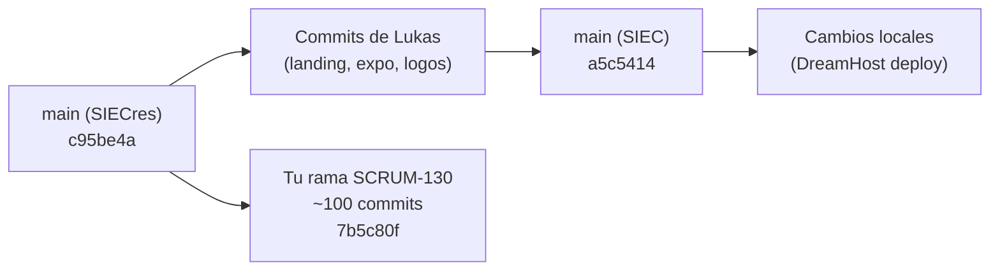

# Análisis de Repositorios SIEC y Plan de Combinación

## Situación Actual

Tienes **dos clones locales del mismo repositorio** (`Raizexs/SIEC`), cada uno con trabajo diferente:

### 📁 `SIEC/` (este proyecto — rama `main`)
- **Rama activa:** `main` (apunta al commit `a5c5414` de Lukas)
- **Contiene:** Los commits de Lukas para la presentación ExpoSmart: landing page, logos SIEC, hero carrusel, favicon, mobile polish
- **Cambios locales sin commit** (hechos en esta conversación para el despliegue a DreamHost):
  - `routes.js` — ruta raíz `/` apunta a ExpoSmartView + guard de redirección en `/login`
  - `ExpoSmartHeader.vue` — soporte para ruta `/`
  - `legal.js` — correo `siec.app@outlook.com`
  - `backend/main.py` — CORS para `siec.exposmart.cl`
  - `package.json` — script `deploy`
  - Archivos nuevos: `.env.production`, `.htaccess`, `scripts/ftp_upload.py`

### 📁 `SIECres/` (tu progreso — rama `SCRUM-130-...`)
- **Rama activa:** `SCRUM-130-adaptar-la-visibilidad-de-capas-3-d-segun-el-material-estructural-seleccionado`
- **Base:** parte del `main` de SIECres (commit `c95be4a`), que está **más adelante** que el `main` de SIEC
- **Contiene ~100 commits** por encima de `main`, con trabajo **muy significativo**:

| Área | Cambios clave |
|------|---------------|
| **Workspace/Editor** | Flujo de 3 pasos (configurar → diseñar → presupuesto), tour guiado, métricas, stepper |
| **Editor 2D** | Leyenda de colores, constraints espaciales, fullscreen mejorado |
| **Scene 3D** | Muros mejorados, cantilever, materiales en fachada, capas por material |
| **Budget** | UI de carga por fases con GSAP, cotización multi-tienda, exportación integrada |
| **SIEC Place** | Marketplace completo (publicar obras, contactos, pagos one-time) |
| **Billing** | Planes Pro/Pro+ con pago único, gates por material, UI de planes |
| **Legal/Privacy** | Términos, política de privacidad, flujo de consentimiento, eliminación de cuenta |
| **Settings** | Refactorizado en 5 componentes, preferencias, apariencia, seguridad |
| **Backend** | Normativa validator, billing service, privacy endpoints, SIEC Place API |
| **i18n** | Traducciones extensas ES/EN para budget, workspace, billing |
| **Motion/UX** | GSAP animaciones en shell, dashboard, sidebar, workspace transitions |
| **Infraestructura** | `docker-compose.yml`, Dockerfiles para backend y scraper |

---

## Diferencia entre los `main` de cada clon

> [!IMPORTANT]
> El `main` en `SIECres` (commit `c95be4a`) es **anterior** al `main` en `SIEC` (commit `a5c5414`). El `main` de SIEC tiene **9 commits adicionales de Lukas** (landing page, ExpoSmart, logos, favicon, mobile UX) que no están en `SIECres/main`.

---

## Propuesta: Crear Estado Combinado para Docker

> [!WARNING]
> Tu rama `SCRUM-130` ya hizo un merge de `origin/main` en el commit `90de35e`, pero ese merge fue con un `main` más viejo. Los 9 commits de Lukas (landing/expo/logos) **no están** en tu rama.

### Pasos propuestos

1. **Trabajar en `SIECres/`** como repositorio principal (ya tiene Docker, más commits, tu progreso)
2. **Hacer fetch** para traer los commits de Lukas desde `origin/main` actualizado
3. **Merge `origin/main` → tu rama SCRUM-130** para incorporar los commits de ExpoSmart/landing de Lukas
4. **Aplicar los cambios locales de DreamHost** que hicimos en esta conversación (routes redirect, correo, CORS)
5. **Ajustar `docker-compose.yml`** para incluir variables de Supabase necesarias
6. **Levantar con `docker-compose up`** para revisar todo integrado

### Archivos que necesitarían merge manual probable

| Archivo | Razón |
|---------|-------|
| `frontend/src/router/routes.js` | Tu rama tiene cambios + Lukas agregó la ruta `/exposmart` |
| `frontend/src/components/shell/AppRail.vue` | Ambos lo tocaron |
| `frontend/src/views/DashboardView.vue` | Lukas agregó landing hero, tú agregaste motion |
| `frontend/src/style.css` | Ambos agregaron tokens de estilo |

---

## Open Questions

> [!IMPORTANT]
> **¿Quieres que trabaje directamente en `SIECres/`?** Necesitaría que abras ese workspace o me des permiso para operar en ese directorio.

> [!IMPORTANT]
> **¿Tu rama SCRUM-130 tiene cambios no commiteados?** Veo que `SIECres` solo tiene 3 archivos sin rastrear (`.opencode/`, `test_siec.db`), lo cual es limpio. ¿Hay algo pendiente de guardar?

> [!IMPORTANT]
> **¿Docker Desktop está instalado y corriendo?** Lo necesitaremos para levantar el compose con PostgreSQL + backend + frontend.

## Verification Plan

### Manual Verification
- Ejecutar `docker-compose up` y verificar que los 3 servicios (db, backend, frontend) arranquen sin errores
- Acceder a `http://localhost:5173` y navegar por los flujos principales (landing → login → workspace)
- Verificar que el editor 2D/3D, budget y SIEC Place funcionen correctamente
